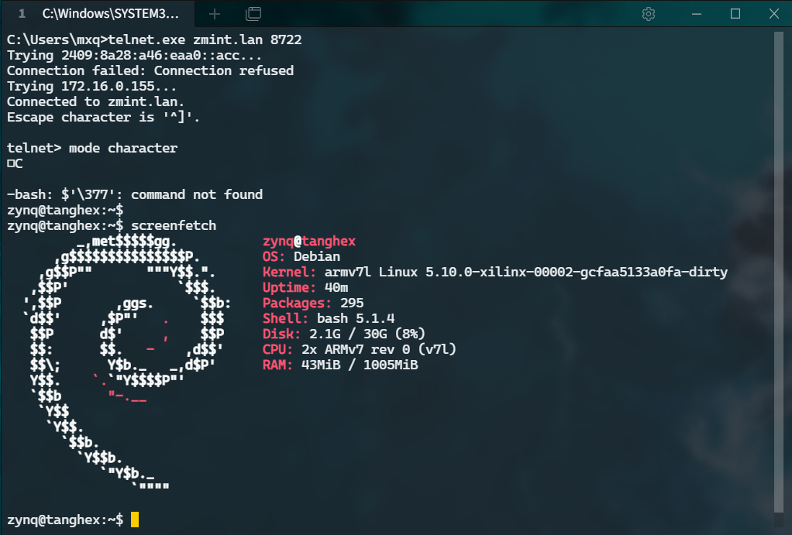

# Serialxy

A proxy tool to help you to connect remote serial port by telnet.

* Support Linux, Windows

## install

```bash
$ cargo install serialxy
```

## example

* host
```bash
$ serialxy /dev/ttyUSB1,115200
```

* client
```bash
$ telnet remote-ip 8722
^]
telnet> mode character
# You can use telnet connect to your serial port as same as using serial port directly
```


